# 🏅 Fabric Pipeline — Olimpíadas de Verão 1896–2024
### *Summer Olympics Data Engineering Pipeline with Microsoft Fabric*

<p align="center">
  
  
  
  
  
</p>

---

## 🇧🇷 Português

### 📌 Sobre o Projeto

Projeto prático focado no exame **DP-600 (Microsoft Fabric Analytics Engineer)**. Implementa uma pipeline completa de engenharia de dados com as camadas **Bronze → Silver → Gold** no **Microsoft Fabric**, utilizando dados históricos das Olimpíadas de Verão de 1896 a 2024.

O objetivo é consolidar conceitos de **governança, orquestração e transformação de dados** no OneLake, com análises focadas no desempenho do Brasil nas Olimpíadas.

> ⚠️ **Nota:** Os dados e tabelas Delta ficam armazenados no Microsoft Fabric (ambiente privado). Este repositório contém apenas o **código-fonte**, os **dados exportados** e a **documentação** do projeto.

---

### 🗂️ Arquitetura da Pipeline

```
Kaggle API (kagglehub)
        │
        ▼
┌─────────────────────────────────────────────────────┐
│               Microsoft Fabric OneLake              │
│                                                     │
│  ┌──────────────┐                                   │
│  │    BRONZE    │  Dados brutos ingeridos via        │
│  │  atletas_    │  Data Factory Pipeline             │
│  │  olimpicos   │  (kagglehub → Delta Table)         │
│  └──────┬───────┘                                   │
│         │  Limpeza e padronização (PySpark)          │
│         ▼                                           │
│  ┌──────────────┐                                   │
│  │    SILVER    │  251.099 registros únicos          │
│  │  atletas_    │  sem duplicatas, tipos corretos    │
│  │  olimpicos   │  e medalhas padronizadas           │
│  │  _tratado    │                                   │
│  └──────┬───────┘                                   │
│         │  Agregações e análises (PySpark)           │
│         ▼                                           │
│  ┌──────────────────────────────────────────────┐   │
│  │                   GOLD                       │   │
│  │  brasil_medalhas_por_ano                     │   │
│  │  brasil_medalhas_por_esporte                 │   │
│  │  brasil_medalhas_por_genero                  │   │
│  └──────────────────────────────────────────────┘   │
└─────────────────────────────────────────────────────┘
```

---

### 📦 Dataset

- **Fonte:** Kaggle — [Summer Olympics Medals 1896–2024](https://www.kaggle.com/datasets/stefanydeoliveira/summer-olympics-medals-1896-2024)
- **Ingestão:** via biblioteca `kagglehub` direto no notebook PySpark
- **Volume:** ~252.000 registros brutos

```python
import kagglehub
path = kagglehub.dataset_download("stefanydeoliveira/summer-olympics-medals-1896-2024")
```

---

### 🛠️ Tecnologias Utilizadas

| Tecnologia | Uso |
|---|---|
| Microsoft Fabric | Plataforma principal (Lakehouse, Pipeline, Notebook) |
| Data Factory (Fabric) | Ingestão e orquestração da pipeline |
| PySpark (Python) | Transformação e análise de dados |
| Delta Lake / OneLake | Armazenamento das camadas Bronze, Silver e Gold |
| kagglehub | Download do dataset diretamente no notebook |
| GitHub | Versionamento do código e documentação |

---

### 🔄 Etapas da Pipeline

#### 🥉 Camada Bronze — Ingestão dos Dados Brutos

Dados carregados com sucesso via `kagglehub` e armazenados como Tabela Delta no Lakehouse.

- ✅ Fonte: `olympics_athletes_dataset.csv` via Kaggle API
- ✅ Tabela: `Bronze_Atletas.atletas_olimpicos`
- ✅ **252.000+ registros** carregados

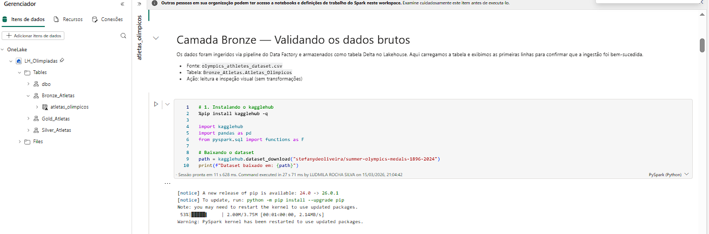
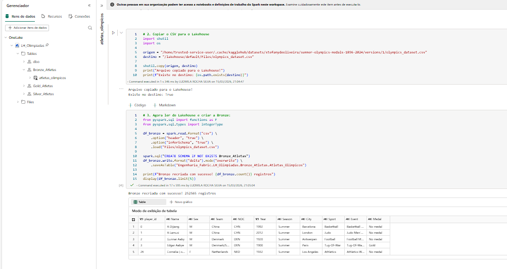

---

#### 🥈 Camada Silver — Limpeza e Padronização

Transformações aplicadas para garantir qualidade e consistência dos dados:

- ✅ Nulos em `medalha` → `"Nenhuma Medalha"`
- ✅ Coluna `year` → `IntegerType`
- ✅ Coluna `esporte` → letras maiúsculas com `F.upper()`
- ✅ Duplicatas → removidas com `dropDuplicates()`
- ✅ **Resultado: 251.099 registros únicos, 0 duplicatas**

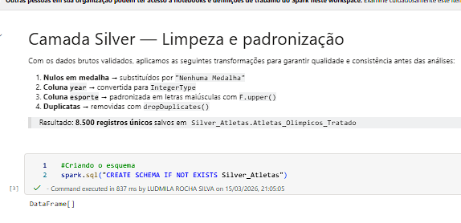
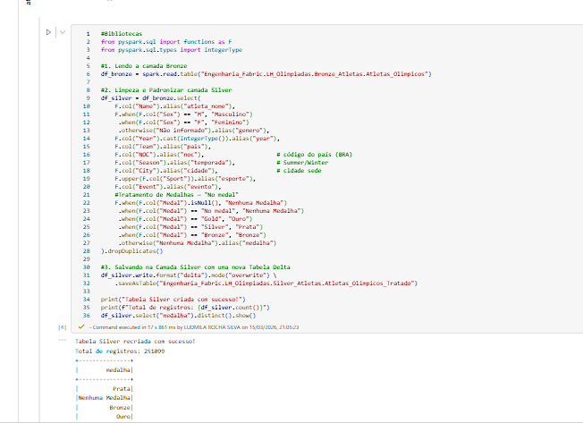
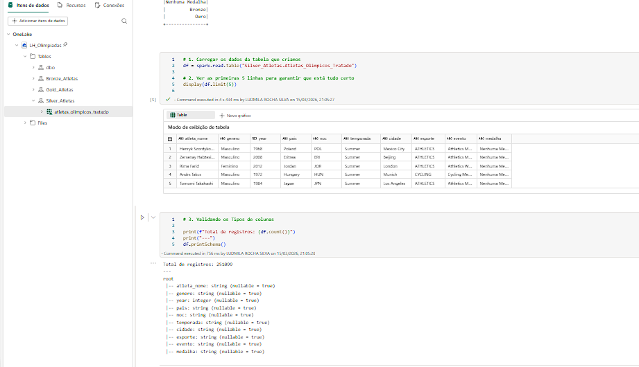
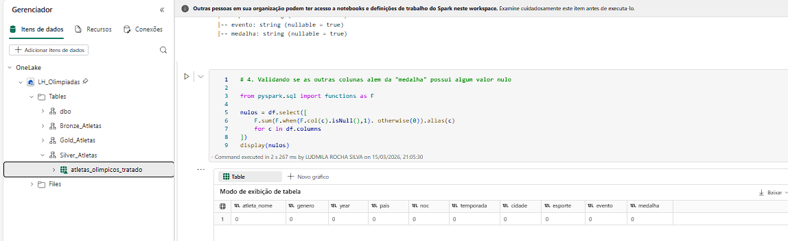
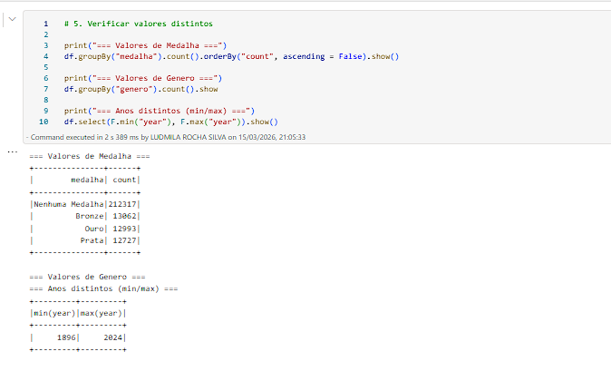
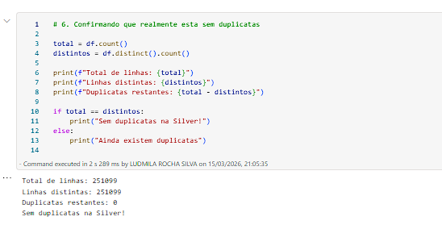

---

#### 🥇 Camada Gold — Análises do Brasil

Filtro aplicado: apenas atletas brasileiros com medalhas. Respostas às perguntas analíticas do projeto.

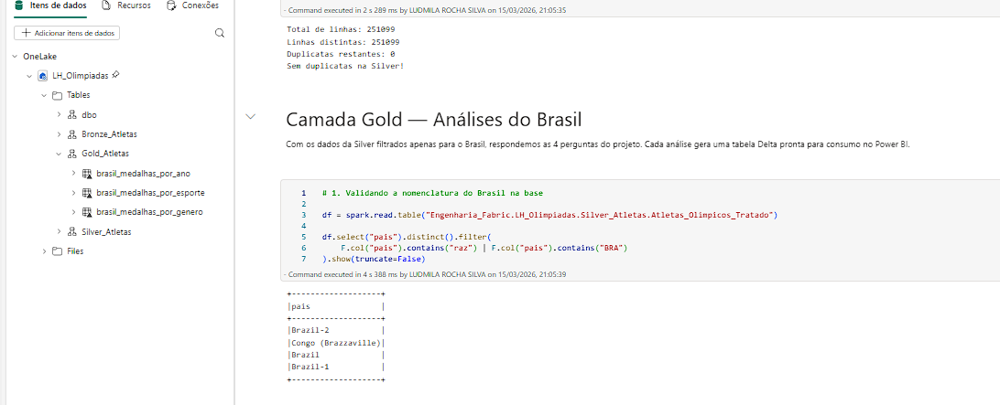
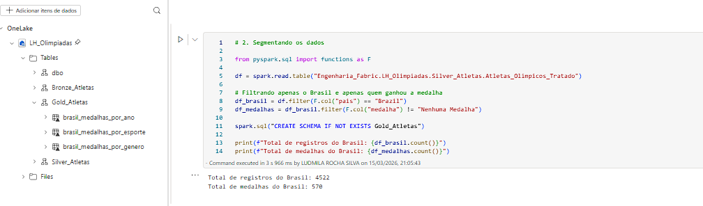
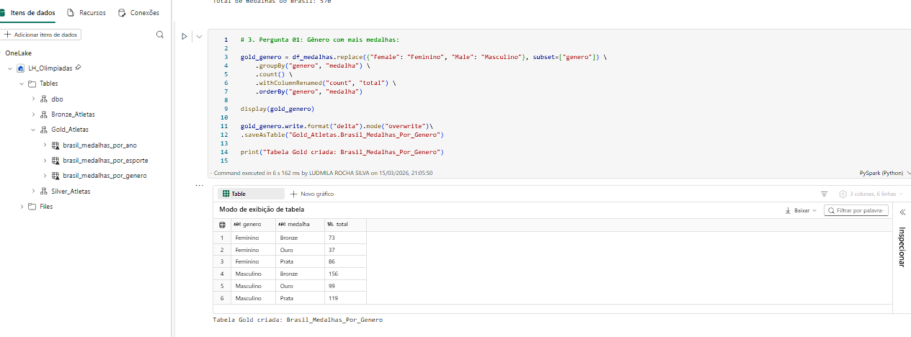
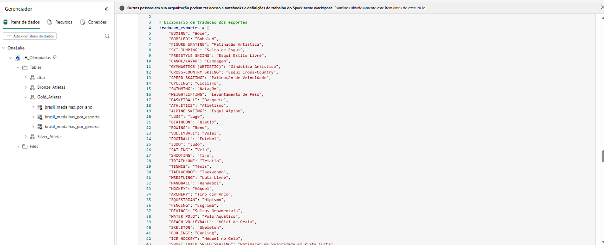
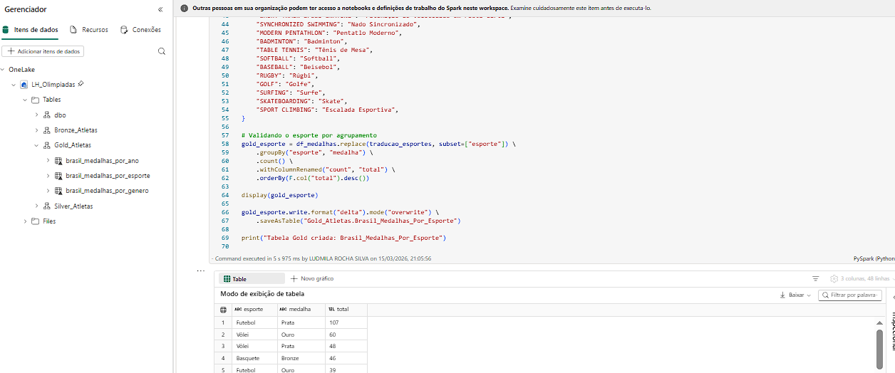
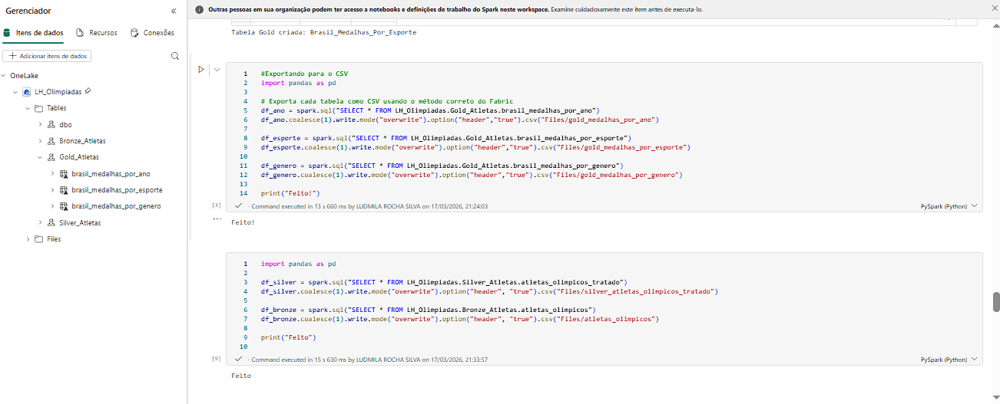
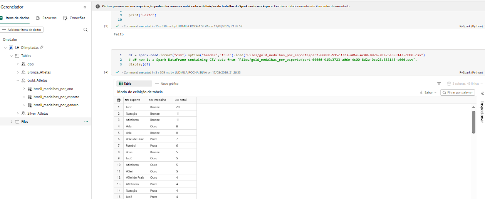
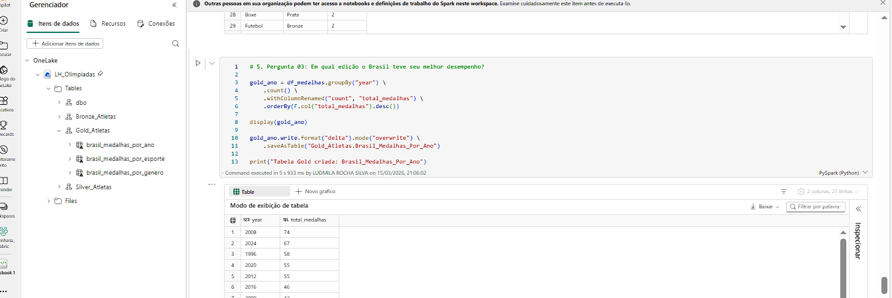
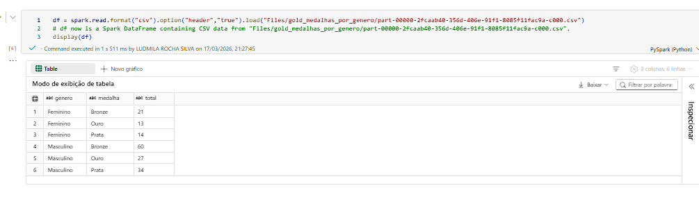
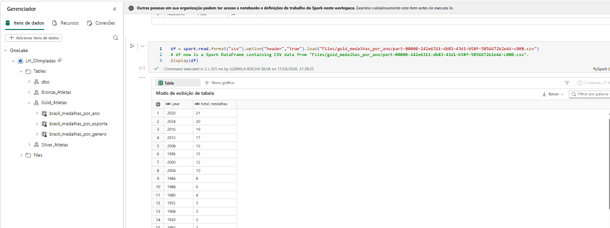

---

### 📊 Resultados

| Métrica | Resultado |
|---|---|
| 🏅 Total de medalhas do Brasil | **570** |
| 🏆 Melhor edição | **Rio 2016 (74 medalhas)** |
| 🤸 Esportes de destaque | Futebol, Vôlei, Atletismo |
| ♀️ Medalhas femininas Bronze | 21 |
| ♂️ Medalhas masculinas Bronze | 27 |
| 📅 Período analisado | 1896 – 2024 |

---

### 🚀 Como Reproduzir

**Pré-requisitos:**
- Conta Microsoft Fabric (trial gratuito em [fabric.microsoft.com](https://app.fabric.microsoft.com))
- Conta Kaggle com API configurada

**Passo a Passo:**

1. Criar o Lakehouse `LH_Olimpiadas` no workspace `Engenharia_Fabric`
2. Criar a Data Pipeline `Pipeline_Ingestao_Git`
3. Instalar e usar o `kagglehub` no notebook:

```python
%pip install kagglehub -q
import kagglehub
path = kagglehub.dataset_download("stefanydeoliveira/summer-olympics-medals-1896-2024")
```

4. Executar as camadas na ordem: `Bronze → Silver → Gold`

---

## 🇺🇸 English

### 📌 About the Project

Hands-on project focused on the **DP-600 (Microsoft Fabric Analytics Engineer)** exam. Implements a complete **data engineering pipeline** with Bronze → Silver → Gold layers in **Microsoft Fabric**, using historical Summer Olympics data from 1896 to 2024.

> ⚠️ **Note:** Data and Delta tables are stored in Microsoft Fabric (private environment). This repository contains only the **source code**, **exported data** and **documentation**.

---

### 🛠️ Tech Stack

| Technology | Usage |
|---|---|
| Microsoft Fabric | Main platform (Lakehouse, Pipeline, Notebook) |
| Data Factory (Fabric) | Pipeline ingestion and orchestration |
| PySpark (Python) | Data transformation and analysis |
| Delta Lake / OneLake | Bronze, Silver and Gold layer storage |
| kagglehub | Dataset download directly in the notebook |
| GitHub | Code versioning and documentation |

---

### 🔄 Pipeline Layers

| Layer | Description | Records |
|---|---|---|
| 🥉 Bronze | Raw data ingested via Data Factory | 252,000+ |
| 🥈 Silver | Cleaned and standardized data | 251,099 unique |
| 🥇 Gold | Brazil-focused aggregated analysis | 3 tables |

---

### 📊 Key Results

| Metric | Result |
|---|---|
| 🏅 Total Brazil medals | **570** |
| 🏆 Best edition | **Rio 2016 (74 medals)** |
| 🤸 Top sports | Football, Volleyball, Athletics |
| 📅 Period | 1896 – 2024 |

---

### 🚀 How to Reproduce

1. Create a free Microsoft Fabric trial at [fabric.microsoft.com](https://app.fabric.microsoft.com)
2. Create a Lakehouse named `LH_Olimpiadas`
3. Create a Data Pipeline named `Pipeline_Ingestao_Git`
4. Run `Notebook.ipynb` in order: Bronze → Silver → Gold

---

## 📁 Estrutura do Repositório / Repository Structure

```
Fabric_Pipeline/
│
├── Notebook.ipynb                     # Pipeline completa (Bronze → Silver → Gold)
├── README.md                          # Documentação do projeto
├── assets/                            # Dados exportados do Fabric
│   ├── atletas_olimpicos.csv          # Bronze — dados brutos
│   ├── silver_atletas_olimpicos.csv   # Silver — dados limpos
│   ├── gold_medalhas_por_ano.csv      # Gold — medalhas por ano
│   ├── gold_medalhas_por_esporte.csv  # Gold — medalhas por esporte
│   └── gold_medalhas_por_genero.csv   # Gold — medalhas por gênero
├── img/                               # Prints das execuções no Microsoft Fabric
│   ├── bronze_1.png ~ bronze_2.png
│   ├── silver_1.png ~ silver_6.png
│   └── gold_1.png ~ gold_10.png
└── .gitignore
```

---

## 👩‍💻 Autora / Author

**Ludmila Rocha**

[](https://github.com/LudmilaRocha)

---

> 📚 Projeto desenvolvido como parte dos estudos para a certificação **DP-600 — Microsoft Fabric Analytics Engineer**
